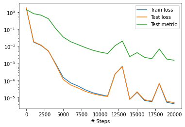
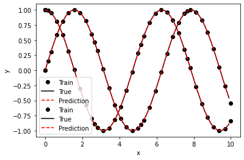

Auto-Encoder를 활용한 Optimal Control Problem 풀이
======================================================================

ODE 풀이
-----------

.. code-block:: python

   import deepxde as dde
   import numpy as np

   def ode_system(x, y):
       """ODE system.
       dy1/dx = y2
       dy2/dx = -y1
       """
       # Most backends
       y1, y2 = y[:, 0:1], y[:, 1:]
       dy1_x = dde.grad.jacobian(y, x, i=0)
       dy2_x = dde.grad.jacobian(y, x, i=1)
       # Backend jax
       # y_val, y_fn = y
       # y1, y2 = y_val[:, 0:1], y_val[:, 1:]
       # dy1_x, _ = dde.grad.jacobian(y, x, i=0)
       # dy2_x, _ = dde.grad.jacobian(y, x, i=1)
       return [dy1_x - y2, dy2_x + y1]

   def boundary(_, on_initial):
       return on_initial

   def func(x):
       """
       y1 = sin(x)
       y2 = cos(x)
       """
       return np.hstack((np.sin(x), np.cos(x)))

   geom = dde.geometry.TimeDomain(0, 10)
   ic1 = dde.icbc.IC(geom, lambda x: 0, boundary, component=0)
   ic2 = dde.icbc.IC(geom, lambda x: 1, boundary, component=1)
   data = dde.data.PDE(geom, ode_system, [ic1, ic2], 35, 2, solution=func, num_test=100)

   layer_size = [1] + [50] * 3 + [2]
   activation = "tanh"
   initializer = "Glorot uniform"
   net = dde.nn.FNN(layer_size, activation, initializer)

   model = dde.Model(data, net)
   model.compile("adam", lr=0.001, metrics=["l2 relative error"])
   losshistory, train_state = model.train(iterations=20000)

   dde.saveplot(losshistory, train_state, issave=True, isplot=True)

   An approximation of the optimal control using the adjoint method

SIR Model
---------

.. code-block:: python

   def func(x):
       """
       y1 = sin(x)
       y2 = cos(x)
       """
       return np.hstack((np.sin(x), np.cos(x)))

   def ode_system(x, y):
       # Most backends
       S, I = y[:, 0:1], y[:, 1:]
       dS_x = dde.grad.jacobian(y, x, i=0)
       dI_x = dde.grad.jacobian(y, x, i=1)

       return [dS_x + beta*S*I, dI_x - beta*S*I + gamma*I]

   def boundary(_, on_initial):
       return on_initial

   geom = dde.geometry.TimeDomain(0, 30)
   ic1 = dde.icbc.IC(geom, lambda x: 990, boundary, component=0)
   ic2 = dde.icbc.IC(geom, lambda x: 10, boundary, component=1)
   data = dde.data.PDE(geom, ode_system, [ic1, ic2], 35, 2, num_test=100)

   layer_size = [1] + [50] * 3 + [2]
   activation = "tanh"
   initializer = "Glorot uniform"
   net = dde.nn.FNN(layer_size, activation, initializer)

   model = dde.Model(data, net)
   model.compile("adam", lr=0.001)
   losshistory, train_state = model.train(iterations=200000)

   dde.saveplot(losshistory, train_state, issave=True, isplot=True)