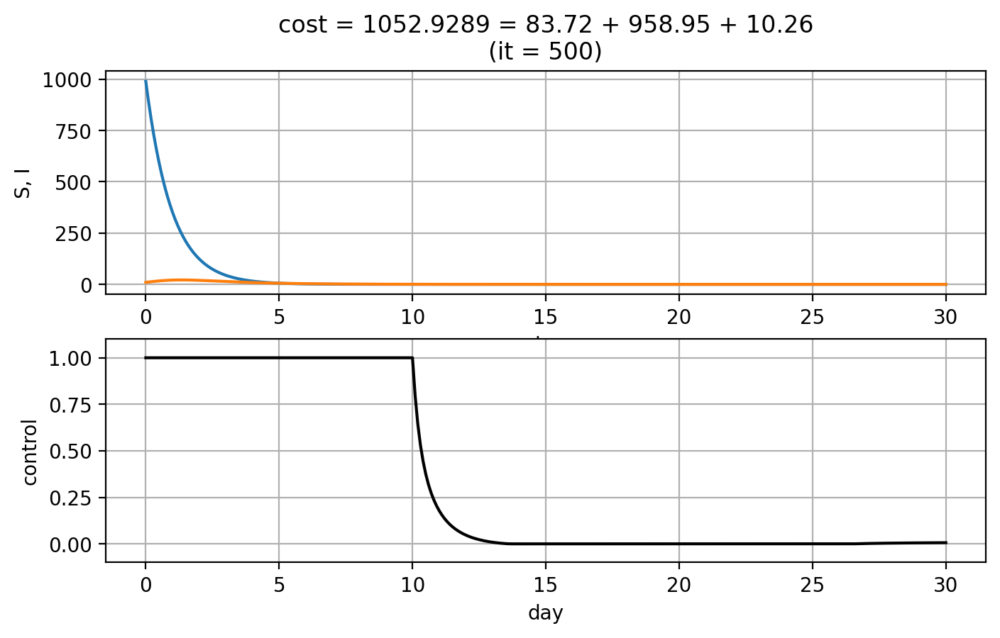
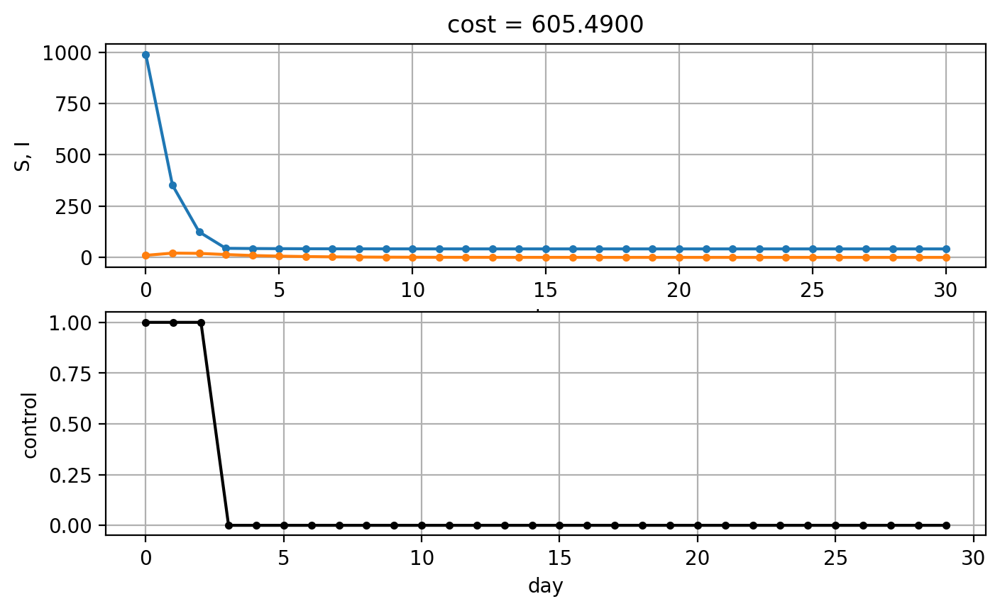
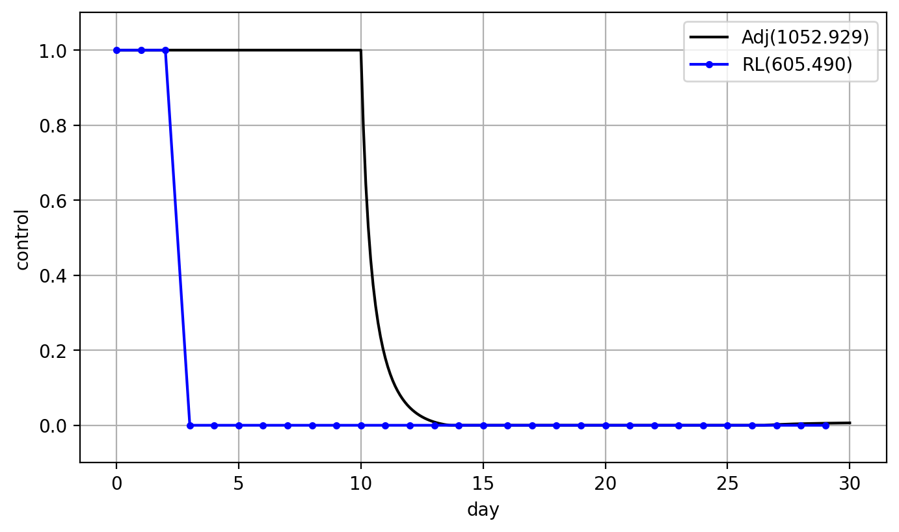

Examples
========

SIR Model
---------

.. math::
   \min_{u\in\mathcal{U}_{ad}} \int_0^{30} I(t) + u(t)S(t) + u^2(t)~dt

subject to

.. math::
   \begin{cases}
   S' &= -\beta SI - uS\\
   I' &= \beta SI - \gamma I
   \end{cases}

State differential Equaiton을 위한 Python 코드는 다음과 같습니다.

.. code-block:: python
   :linenos:

   def sir(y, t, beta, gamma, u_interp):
       S, I = y
       return np.array([-beta * S * I - u_interp(t) * S, beta * S * I - gamma * I])

다음과 같은 Initial 및 Parameter를 사용했습니다.

* :math:`S(0) = 990`
* :math:`I(0) = 10`
* :math:`\beta = 0.002`
* :math:`\gamma = 0.5`

Adjoint method
^^^^^^^^^^^^^^

.. math::
   H &= f + \lambda\cdot g\\
     &= I + uS + u^2 + \begin{bmatrix}\lambda_S\\\lambda_I\end{bmatrix} \cdot \begin{bmatrix}-\beta SI -uS \\ \beta SI - \gamma I \end{bmatrix}\\
     \lambda' &= -\frac{\partial H}{\partial x}

.. math::
   \begin{cases}
   \lambda_S' &= -u - \beta I (\lambda_I - \lambda_S) + u \lambda_S\\
   \lambda_I' &= -1 - \beta S(\lambda_I - \lambda_S) + \gamma \lambda_I
   \end{cases}

.. code-block:: python
   :linenos:

   def adjoint_sir(y, t, x_interp, beta, gamma, w1, w2, w3, u_interp):
       l_S, l_I = y
       S, I = x_interp(t)
       u = u_interp(t)
       dHdS = w2 * u + beta * I * (l_I - l_S) - u * l_S
       dHdI = w1 + beta * S * (l_I - l_S) - gamma * l_I
       return -np.array([dHdS, dHdI])

Simple Gradient를 사용하여 Optimal control을 구하는 코드는 다음과 같습니다.

.. code-block:: python
   :linenos:

   import numpy as np
   from scipy.integrate import odeint
   from scipy.interpolate import interp1d

   t0 = 0
   tf = 30
   beta = 0.002
   gamma = 0.5
   S0 = 990
   I0 = 10
   w1, w2, w3 = 1, 1, 1

   # Initial
   y0 = np.array([S0, I0])
   t = np.linspace(t0,tf, 301)
   dt = t[1] - t[0]
   u0 = np.ones_like(t)

   MaxIter = 500 + 1
   alpha = 1E-1
   old_cost = 1E8
   for it in range(MaxIter):
       # State
       u_intp = lambda tc: np.interp(tc, t, u0)
       sol = odeint(sir, y0, t, args=(beta, gamma, u_intp))

       # Cost
       S, I = np.hsplit(sol, 2)
       S_mid = (S[1:] + S[:-1]) / 2.
       I_mid = (I[1:] + I[:-1]) / 2.
       u_mid = (u0[1:] + u0[:-1]) / 2.
       cost1 = dt * w1 * np.sum(I_mid.flatten())
       cost2 = dt * w2 * np.sum(S_mid.flatten() * u_mid)
       cost3 = dt * w3 * np.sum(u_mid.flatten() ** 2)
       cost = cost1 + cost2 + cost3

       # Adjoint
       u_intp = lambda tc: np.interp(tf - tc, t, u0)
       x_intp = lambda tc: np.array([np.interp(tf - tc, t, sol[:, 0]), np.interp(tf - tc, t, sol[:, 1])])
       y_T = np.array([0,0])
       l_sol = odeint(adjoint_sir, y_T, t, args=(x_intp, beta, gamma, w1, w2, w3, u_intp))
       l_sol = np.flipud(l_sol)

       # Simple Gradient
       Hu = w2 * sol[:, 0] + 2 * w3 * u0 - l_sol[:,0] * sol[:, 0]
       u1 = np.clip(u0 - alpha * Hu , 0, 1)
       if old_cost < cost:
           alpha = alpha / 1.1 # simple adaptive learning rate

       # Convergence
       if np.abs(old_cost - cost) / alpha  <= 1E-7:
           break

       old_cost = cost
       u0 = u1

  An approximation of the optimal control using the adjoint method

Reinforcement Learning
^^^^^^^^^^^^^^^^^^^^^^

강화학습은 Discrete time이므로, :math:`\varDelta t = 1` 로 설정 후 Reward Design은 Cost function과 동일하게 설정했습니다.

.. math::
   R = - I - u S - u^2

.. code-block:: python
   :linenos:

   import numpy as np
   from scipy.integrate import odeint

   def sir(y, t, beta, gamma, u):
       S, I = y
       dydt = np.array([-beta * S * I - u * S, beta * S * I - gamma * I])
       return dydt

   class SirEnvironment:
       def __init__(self, S0=990, I0=10):
           self.state = np.array([S0, I0])
           self.beta = 0.002
           self.gamma = 0.5

       def reset(self, S0=990, I0=10):
           self.state = np.array([S0, I0])
           self.beta = 0.002
           self.gamma = 0.5
           return self.state

       def step(self, action):
           sol = odeint(sir, self.state, np.linspace(0, 1, 101), args=(self.beta, self.gamma, action))
           new_state = sol[-1, :]
           S0, I0 = self.state
           S, I = new_state
           self.state = new_state
           reward = - I - action * S - action**2
           done = True if new_state[1] < 1.0 else False
           return (new_state, reward, done, 0)

.. code-block:: python
   :linenos:

   import random
   import torch
   import numpy as np
   from collections import deque
   from dqn_agent import Agent

   env = SirEnvironment()
   agent = Agent(state_size=2, action_size=2, seed=0)

   ## Parameters
   n_episodes=2000
   max_t=30
   eps_start=1.0 # Too large epsilon for a stable learning
   eps_end=0.001
   eps_decay=0.995

   ## Loop to learn
   scores = []                        # list containing scores from each episode
   scores_window = deque(maxlen=100)  # last 100 scores
   eps = eps_start                    # initialize epsilon
   for i_episode in range(1, n_episodes+1):
       state = env.reset()
       score = 0
       actions = []
       for t in range(max_t):
           action = agent.act(state, eps)
           actions.append(action)
           next_state, reward, done, _ = env.step(action)
           agent.step(state, action, reward, next_state, done)
           state = next_state
           score += reward
           if done:
               break
       scores_window.append(score)       # save most recent score
       scores.append(score)              # save most recent score
       eps = max(eps_end, eps_decay*eps) # decrease epsilon

  An approximation of the optimal control using the reinforcement learning

Comparision
^^^^^^^^^^^

  Adjoint method와 강화학습으로 얻은 결과 비교

SLIAR Model
-----------

Adjoint method
^^^^^^^^^^^^^^

Reinforcement Learning
^^^^^^^^^^^^^^^^^^^^^^

Auto-Encoder
^^^^^^^^^^^^

Comparision
^^^^^^^^^^^